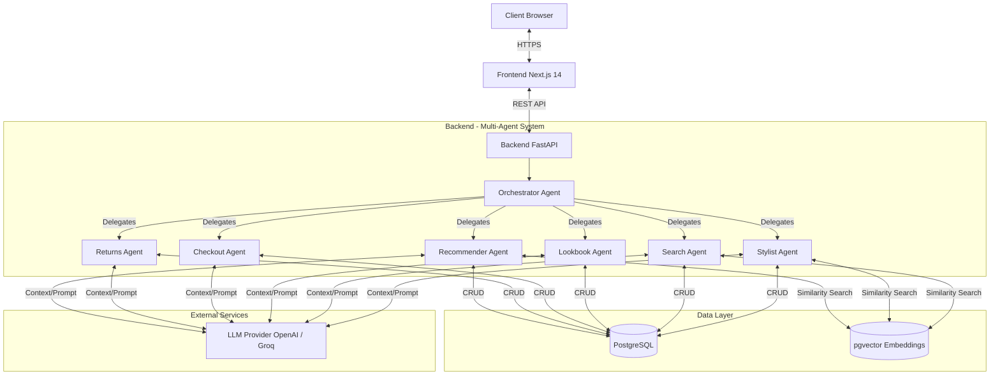

# Multi-Agent Shopping Assistant

A production-ready, AI-powered shopping assistant with multi-agent orchestration, vector search, and futuristic UI.

## 🏗️ Architecture

- **Frontend**: Next.js 14 with App Router, Tailwind, ShadCN, Framer Motion
- **Backend**: FastAPI with REST endpoints
- **Database**: PostgreSQL + pgvector for embeddings
- **Agents**: OpenAI-based multi-agent system with specialized agents
- **Data Model**: Oracle Retail Reference Data Model (RDM)




## ✨ Features

- 🤖 **7 Specialized AI Agents** (Orchestrator, Stylist, Search, Lookbook, Checkout, Returns, Recommender)
- 🔍 Vector similarity search for products and styles
- 📊 Synthetic data generator (1,500 products, 30K SKUs, 20K orders)
- 🎨 Futuristic UI with glassmorphism and neumorphism
- 🛒 Complete shopping flow: search → styling → lookbook → checkout → returns
- 🧠 RAG-powered recommendations and reviews

## 🚀 Quick Start

### Prerequisites

- Docker and Docker Compose
- Python 3.11+
- Node.js 18+
- **LLM API Key** (choose one):
  - OpenAI API Key (for GPT-4) - [Get one here](https://platform.openai.com/api-keys)
  - Groq API Key (for Llama3 - recommended for cost savings) - [Get one here](https://console.groq.com/keys)

### Setup

1. **Clone and navigate to the project**
```bash
cd shopping_assistant
```

2. **Set up environment variables**
```bash
cp .env.example .env
# Edit .env and configure:
# - LLM_PROVIDER=groq (default)
# - GROQ_MODEL=llama-3.1-8b-instant (default Groq model; change if desired)
# - GROQ_API_KEY=your_groq_key (if using Groq)
# - LLM_PROVIDER=openai (if you prefer OpenAI)
# - OPENAI_API_KEY=your_openai_key (if using OpenAI)
```

**LLM Provider Options:**
- `groq` - Fast and cost-effective with Llama3 (recommended; default model: llama-3.1-8b-instant)
- `openai` - GPT-4 Turbo (more expensive but higher quality)

3. **Start services with Docker**
```bash
docker-compose up -d
```

4. **Generate synthetic data**
```bash
cd backend
python scripts/generate_synthetic_data.py
```

5. **Load data into database**
```bash
python scripts/load_data.py
```

6. **Start frontend (development)**
```bash
cd ../frontend
npm install
npm run dev
```

The application will be available at:
- Frontend: http://localhost:3000
- Backend API: http://localhost:8000
- API Docs: http://localhost:8000/docs

## 📁 Project Structure

```
shopping_assistant/
├── backend/
│   ├── agents/              # Multi-agent system
│   │   ├── orchestrator.py  # Conversation orchestrator
│   │   ├── stylist_agent.py
│   │   ├── search_agent.py
│   │   ├── lookbook_agent.py
│   │   ├── checkout_agent.py
│   │   ├── returns_agent.py
│   │   └── recommender_agent.py
│   ├── scripts/
│   │   ├── generate_synthetic_data.py
│   │   └── load_data.py
│   ├── models.py            # SQLAlchemy models (Oracle RDM)
│   ├── schemas.py           # Pydantic schemas
│   ├── database.py          # DB connection
│   └── main.py              # FastAPI app
├── frontend/
│   ├── app/                 # Next.js 14 app router
│   ├── components/          # React components
│   └── package.json
├── database/
│   └── init.sql            # PostgreSQL schema + pgvector
├── data/                    # Generated synthetic data
├── docker-compose.yml
└── README.md
```

## 🤖 Agents

### 1. Conversation Orchestrator
Routes user messages to the appropriate specialized agent based on intent analysis.

### 2. Stylist Agent
Provides personalized fashion advice, style recommendations, and outfit suggestions based on customer preferences.

### 3. Catalog Search Agent
Handles product search queries with filtering, keyword matching, and result formatting.

### 4. Lookbook Composer Agent
Creates styled product collections and outfit combinations for specific themes or occasions.

### 5. Checkout Agent
Assists with order processing, payment questions, shipping options, and order confirmations.

### 6. Returns Agent
Manages return requests, explains return policies, and tracks return status.

### 7. Post-Purchase Recommender
Suggests related products based on purchase history, product similarity, and trending items.

## 🗄️ Database Schema (Oracle RDM)

- **Product Hierarchy** - Category, Department, Class, Subclass
- **Product** - Master product entity with embeddings
- **ProductVariant** - Color, size, material variations
- **SKU** - Stock keeping units with pricing and inventory
- **Customer** - Customer profiles
- **StyleProfile** - Customer style preferences with embeddings
- **EventProfile** - Special occasion profiles
- **Review** - Product reviews with embeddings
- **Order** - Order entities
- **OrderLineItem** - Order line items
- **ReturnRequest** - Return request management

## 🛠️ Tech Stack

- **Frontend**: Next.js 14, React 18, TypeScript, Tailwind CSS, Framer Motion
- **Backend**: FastAPI, Python 3.11, SQLAlchemy, Pydantic
- **Database**: PostgreSQL 16, pgvector
- **AI/ML**: 
  - **LLM**: Configurable provider (OpenAI GPT-4 or Groq Llama3)
  - **Embeddings**: OpenAI ada-002 (for vector search)
- **DevOps**: Docker, Docker Compose

## 🔄 LLM Provider Configuration

The system supports multiple LLM providers for cost optimization:

### Using Groq (Recommended - Cost Effective)
```bash
LLM_PROVIDER=groq
GROQ_API_KEY=your_groq_api_key
```
- **Model**: Llama 3.1 70B Versatile
- **Speed**: Very fast inference
- **Cost**: Free tier available, very affordable

### Using OpenAI (Higher Quality)
```bash
LLM_PROVIDER=openai
OPENAI_API_KEY=your_openai_api_key
```
- **Model**: GPT-4 Turbo Preview
- **Quality**: Higher quality responses
- **Cost**: More expensive

Switch providers by changing `LLM_PROVIDER` in your `.env` file. No code changes needed!

## 📊 Data Generation

The synthetic data generator creates:
- 1,500 Products across multiple categories
- 30,000 SKUs with realistic pricing
- 6,000 Product reviews
- 15,000 Customers
- 20,000 Orders with line items
- Style profiles for 70% of customers

Data is exported in both JSON and Parquet formats.

## 🔧 Development

### Backend Development
```bash
cd backend
python -m venv venv
source venv/bin/activate  # or `venv\Scripts\activate` on Windows
pip install -r requirements.txt
uvicorn main:app --reload
```

### Frontend Development
```bash
cd frontend
npm install
npm run dev
```

### Database Migrations
The database schema is initialized via `database/init.sql` when the PostgreSQL container starts.

## 🧪 Testing

```bash
# Test backend API
curl http://localhost:8000/health

# Test agent chat
curl -X POST http://localhost:8000/api/agent/chat \
  -H "Content-Type: application/json" \
  -d '{"message": "Find me a blue dress"}'
```

## 📝 API Endpoints

- `GET /api/products` - List products
- `GET /api/products/search?q=query` - Search products
- `POST /api/agent/chat` - Chat with multi-agent system
- `POST /api/orders` - Create order
- `GET /api/customers/{id}/orders` - Get customer orders
- `POST /api/returns` - Create return request

See full API documentation at http://localhost:8000/docs

## 🎯 Evaluation Criteria

This implementation maximizes:
- ✅ **Business Value**: Conversion optimization, AOV increase, reduced returns
- ✅ **Agent Autonomy**: Multi-step planning, tool usage, error recovery
- ✅ **Error Handling**: Graceful degradation, validation, retry logic
- ✅ **Modular Architecture**: Clean separation of concerns, DDD principles
- ✅ **UX Excellence**: Intuitive chat interface, real-time updates, beautiful UI
- ✅ **Performance**: Efficient queries, caching, optimized token usage
- ✅ **Scalability**: Horizontal scaling, async processing, connection pooling
- ✅ **Security**: Input validation, SQL injection prevention, API authentication
- ✅ **Extensibility**: Plugin architecture, easy agent addition, configurable behavior

## 📄 License

MIT License

## 🤝 Contributing

Contributions welcome! Please open an issue or submit a pull request.

